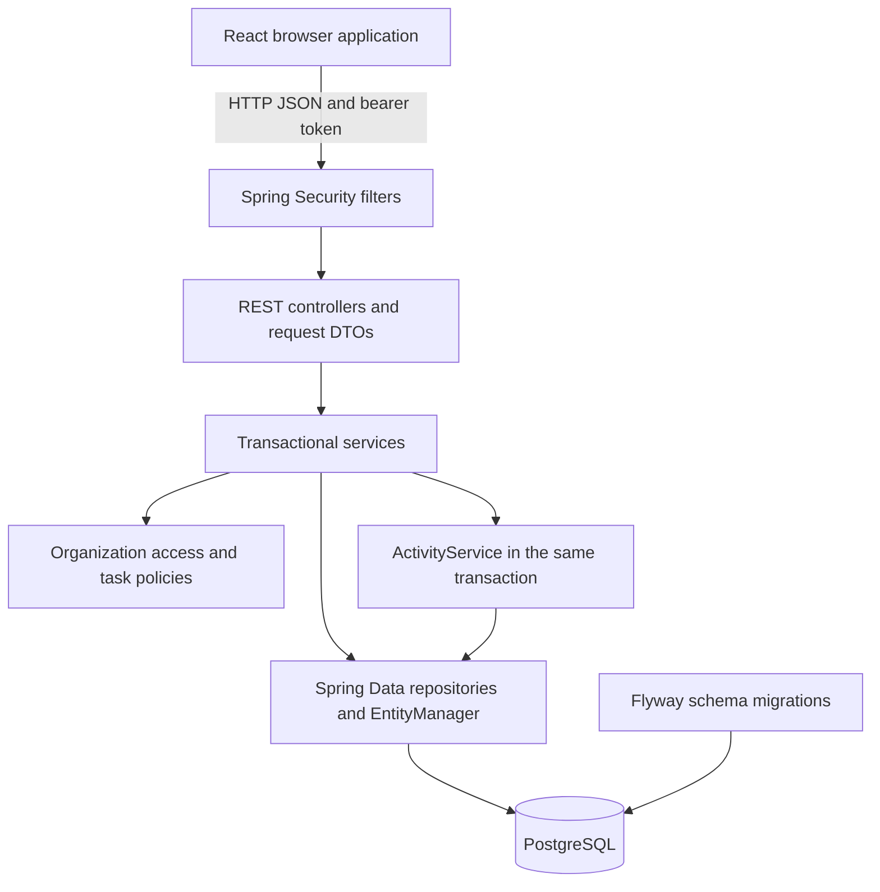

# Enterprise Workflow Platform: Complete Project Interview Handbook

This is a study companion for **this repository**, written in plain English. It explains what the application does, why its design makes sense, where alternatives would fit, and how to answer follow-up questions. It contains **160 questions with answers**, walkthroughs, SQL exercises, a demonstration script, and a study plan. No document can predict every interview question; the aim is to teach reasoning so you can handle new ones.

The source code is the authority for implementation details. Test results quoted here are the recorded local results from **2026-09-30**, not tests rerun to produce this document. See [verification evidence](docs/verification.md). Future designs are explicitly described as proposals.

**How to practice:** read an answer, close the file, explain it in your own words, then open the linked code and show the relevant behavior. Treat first-person sample answers as wording to adapt after you understand them. Do not claim work, production experience, or measurements you cannot demonstrate.

## Contents

1. [Explain the project](#1-explain-the-project)
2. [Understand the system from end to end](#2-understand-the-system-from-end-to-end)
3. [Technology choices and alternatives: Q1–Q20](#3-technology-choices-and-alternatives)
4. [Java and Spring fundamentals: Q21–Q35](#4-java-and-spring-fundamentals)
5. [Database design and SQL: Q36–Q50](#5-database-design-and-sql)
6. [Authentication and security: Q51–Q70](#6-authentication-and-security)
7. [Permissions and business rules: Q71–Q80](#7-permissions-and-business-rules)
8. [Transactions and concurrency: Q81–Q95](#8-transactions-and-concurrency)
9. [API design and query performance: Q96–Q110](#9-api-design-and-query-performance)
10. [React and browser behavior: Q111–Q125](#10-react-and-browser-behavior)
11. [Testing and evidence: Q126–Q135](#11-testing-and-evidence)
12. [Deployment and system design: Q136–Q150](#12-deployment-and-system-design)
13. [Troubleshooting and interview scenarios: Q151–Q160](#13-troubleshooting-and-interview-scenarios)
14. [SQL and coding practice](#14-sql-and-coding-practice)
15. [Demonstration and preparation plan](#15-demonstration-and-preparation-plan)
16. [Quick revision and glossary](#16-quick-revision-and-glossary)

## 1. Explain the project

### The problem

A team needs one place to organize projects, assign work, discuss tasks, and track progress. A basic CRUD application can store tasks, but it does not automatically prevent an outsider from reading them, two people from overwriting each other, or a removed member from receiving a new assignment. This project makes those rules explicit.

The main hierarchy is **organization → project → task**. Users join organizations through memberships. Comments, labels, and activity records give tasks context. A user can be an administrator in one organization and an ordinary member in another.

### A 30-second answer

> This is a full-stack workflow and project management application built with Java 21, Spring Boot, React, and PostgreSQL. Teams create organizations and projects, assign tasks, and move them through a validated workflow. The backend enforces organization-specific permissions, handles concurrent edits, and records activity in the same transaction as the change. Authentication uses short-lived access JWTs and rotating refresh cookies. I can demonstrate the functionality and the automated tests locally.

### A two-minute answer

> The application helps a team manage projects and tasks with clear permissions. An organization is the tenant boundary, and each membership has an owner, admin, manager, or member role. All active members can see the organization's projects, but their write permissions differ. For example, an ordinary member can update the title, description, and status of an assigned task, but cannot reassign it or change its priority.
>
> The backend is a modular monolith. Controllers handle HTTP contracts, services own transactions and business rules, and repositories access PostgreSQL. React provides the dashboard, board and table views, task details, and membership screens. DTOs keep persistence objects out of the public API.
>
> The most interesting design decisions concern correctness. Organization-level database locks coordinate assignments with member removal and protect task-number allocation. Version fields reject stale edits. Activity records commit or roll back with the business change. Composite foreign keys prevent attaching a label from a different project.
>
> Authentication uses Spring Security's JWT support. Access tokens stay in browser memory; refresh tokens are random opaque values stored as hashes and rotated on use. Replaying a consumed refresh token revokes its family. The test suite includes unit tests, PostgreSQL API tests, frontend tests, and a real browser workflow. This is an educational application verified locally; public deployment and load testing remain future work.

### What makes the project more than CRUD?

| Concern | Concrete example you can demonstrate |
|---|---|
| Authorization | Changing a task UUID does not bypass organization membership checks. |
| Business policy | A member cannot set an assigned task's priority. |
| State machine | TODO cannot jump directly to DONE. |
| Concurrency | A stale edit version returns 409 instead of overwriting a newer edit. |
| Cross-table consistency | A task cannot receive another project's label. |
| Transactional history | A failed task update leaves no successful-change activity entry. |
| Session security | A consumed refresh token cannot keep refreshing a session. |
| Query behavior | Task summaries use bulk reads instead of a user query for every row. |

### A good pattern for any design answer

Use **requirement → decision → mechanism → trade-off → evidence**.

Example: “Members can be removed while other requests assign work. I coordinate both operations using the organization's database row lock. After obtaining it, the service checks current membership before assigning. This simplifies correctness but serializes writes within a busy organization. The integration suite checks removal, access denial, and concurrent task creation; a larger race/load suite would be a useful extension.”

## 2. Understand the system from end to end

### Architecture



Authentication answers **who is calling**. Authorization answers **whether that person may perform this operation on this resource**. Validation answers **whether the request is well formed**. Business rules answer **whether the change is allowed in the current state**. A valid JWT satisfies only the first of these concerns.

### Read these files in this order

Paths below are relative to the repository root. Most Java links lead directly to the implementation.

| Learn | Start here | What to notice |
|---|---|---|
| Build and configuration | [pom.xml](backend/pom.xml), [application.yml](backend/src/main/resources/application.yml) | Dependencies, properties, migration and JPA settings. |
| Database invariants | [V1 migration](backend/src/main/resources/db/migration/V1__initial_schema.sql) | Foreign keys, unique constraints, indexes, cascading deletes. |
| HTTP request shape | [TaskController](backend/src/main/java/com/example/workflow/task/TaskController.java), [TaskDtos](backend/src/main/java/com/example/workflow/task/TaskDtos.java) | Routes, DTOs, validation, response codes. |
| Task use cases | [TaskService](backend/src/main/java/com/example/workflow/task/TaskService.java) | Authorization, locks, versions, mutation, activity, DTO mapping. |
| Tenant boundary | [OrganizationAccess](backend/src/main/java/com/example/workflow/organization/OrganizationAccess.java) | Resolve ownership from stored data and check active membership. |
| Field permissions and status | [TaskPolicy](backend/src/main/java/com/example/workflow/task/TaskPolicy.java), [TaskWorkflow](backend/src/main/java/com/example/workflow/task/TaskWorkflow.java) | Role restrictions and explicit transition map. |
| Login and JWT | [AuthService](backend/src/main/java/com/example/workflow/auth/AuthService.java), [SecurityConfig](backend/src/main/java/com/example/workflow/auth/SecurityConfig.java) | Password verification, decoder configuration, CSRF, CORS. |
| Session lifecycle | [RefreshTokenService](backend/src/main/java/com/example/workflow/auth/RefreshTokenService.java) | Random values, hashes, rotation, family revocation, commit behavior. |
| PATCH contract | [Patch](backend/src/main/java/com/example/workflow/common/Patch.java) | Missing versus null, allowed fields, required version. |
| Query composition | [TaskSpecifications](backend/src/main/java/com/example/workflow/task/TaskSpecifications.java) | Filters, escaped search, sorting. |
| Browser API calls | [client.js](frontend/src/api/client.js) | Memory token, refresh coordination, bounded retries, CSRF. |
| Behavioral evidence | [WorkflowApiIT](backend/src/test/java/com/example/workflow/WorkflowApiIT.java), [verification](docs/verification.md) | Actual security filters and actual PostgreSQL. |

### Trace A: creating a task

1. A manager submits a title, priority, and optional assignee from React.
2. The centralized client attaches the in-memory access token as a bearer token.
3. Spring Security validates the JWT. The controller parses the project UUID and validates the request DTO.
4. `TaskService.create` enters a transaction and asks `OrganizationAccess` for writable access to the project. The write path locks the parent **organization row** and refreshes project state.
5. The service checks the caller's role, the project's archive state, and the proposed assignee's active membership.
6. It takes `Project.nextTaskNumber`, increments the counter, and creates a TODO task. The reporter is the authenticated user, not a client-selected user.
7. It writes task activity in the same transaction and builds the response DTO using explicit summary reads.
8. On success, the transaction commits and the controller returns 201. A failure rolls back the business writes and activity together.

### Trace B: two users edit the same task

Both users load version 4. Alice submits version 4 and succeeds; the stored version advances. Bob then submits version 4. After acquiring the write lock and refreshing the task, the service sees Bob's version is stale and returns 409. The UI reports the conflict; automatic merging is not implemented. Bob must reload and reconsider the edit.

The row lock coordinates operations occurring now. The version tells the server whether the user's earlier view is still current. Those solve different problems.

### Trace C: restore a session after reloading the page

The memory access token disappears on reload. The browser still has an HttpOnly refresh cookie. The frontend obtains a CSRF token and posts to the refresh endpoint. The server hashes the cookie value, finds its database record, locks the user row, and checks the refreshed token state. A valid token becomes consumed and a replacement is issued in the same family. The response provides a new access token and replaces the cookie. The new refresh token retains the family's original expiration deadline.

### Actual scope versus possible extensions

| Implemented | Not implemented |
|---|---|
| Existing registered users added to organizations | Email invitation delivery or pending invitation acceptance |
| Organization membership controls project access | Private projects with separate project membership |
| Board with the current result page | A board loading every task, or drag-and-drop |
| Local activity history | Event sourcing or a tamper-proof compliance archive |
| JWT access and refresh rotation | SSO, full OAuth authorization-server flows, MFA |
| Docker and CI definitions | An observed Docker/hosted-CI run or public deployment |
| Query-count regression testing | Measured throughput, latency targets, or capacity guarantees |

## 3. Technology choices and alternatives

### Q1. Why did you use Java 21?

Java provides static typing, mature database tooling, and a strong backend ecosystem. This code uses records for DTOs, enums for business states, and standard collections for policy logic. Java 21 is the selected project baseline. I would not claim that every available Java 21 feature is used; virtual threads, for example, are not enabled here.

### Q2. Why Java rather than Node.js or Python?

The goal included learning enterprise Java patterns, and the domain benefits from typed contracts and Spring's transaction/security integration. Node.js would let a JavaScript team share a language across the stack; Python can suit a team centered on its ecosystem. Those are viable alternatives. I would choose based on team experience, libraries, operations, and workload, not assert that one language is always faster.

### Q3. Why Spring Boot rather than plain Spring?

Boot supplies dependency coordination, conditional auto-configuration, an embedded server, and application configuration conventions. That reduces setup for a web API with persistence and security. It still uses Spring underneath. Explicit configuration remains important: this project defines its security behavior instead of assuming the defaults match its session design.

### Q4. Why Spring MVC rather than WebFlux?

The persistence layer is blocking JPA/JDBC, and normal request/response CRUD fits Spring MVC. Adding a reactive controller would not make blocking database calls nonblocking. An end-to-end reactive design could be worth evaluating for a suitable streaming or I/O-heavy workload, but it would change persistence and debugging patterns as well.

### Q5. Why a modular monolith rather than microservices?

Tasks, membership, and activity have closely related consistency rules. One application and database let a transaction cover them without distributed coordination. Feature packages provide organization inside the monolith. Microservices would introduce deployment, network failure, service authentication, and data-consistency work. I would consider extraction when independent ownership or scaling needs justified that cost.

### Q6. Why PostgreSQL rather than MongoDB?

This model has many relationships and invariants: unique memberships, project-scoped task numbers, and labels restricted to their project. PostgreSQL expresses them with foreign keys and unique constraints while supporting transactions and reporting queries. MongoDB can support transactions too; the reason is the natural relational fit, not a false claim that document databases have no consistency features.

### Q7. Why PostgreSQL rather than MySQL?

MySQL could implement this application. PostgreSQL is the chosen dialect, and the schema uses features such as a partial unique index for one active organization owner. Moving databases would require reviewing SQL, indexes, migrations, and tests. I would not claim universal performance superiority without comparative measurements for this workload.

### Q8. Why JPA and Hibernate rather than writing all JDBC manually?

JPA handles entity persistence, dirty checking, versions, and common repository operations. Hibernate is the provider. This reduces repetitive mapping code while still allowing explicit queries. The trade-off is that I must understand generated SQL and flush behavior. JDBC or a SQL-focused tool could be attractive if complex SQL dominated the application.

### Q9. Why Flyway rather than Hibernate schema update?

Flyway gives the schema a versioned, reviewable history. Hibernate is configured to validate rather than silently change the schema on startup. A new persistent change should get a new migration. In a database already using V1, editing V1 is not a normal upgrade strategy; it can produce checksum errors and inconsistent environments.

### Q10. Why Maven rather than Gradle?

Maven provides a familiar lifecycle and declarative dependency configuration for this Java application. The wrapper fixes the build-tool version. Gradle is also suitable, especially for builds that need its customization model. For this repository, changing build tools would add migration effort without a demonstrated application benefit.

### Q11. Why React rather than Angular or Vue?

React fits a component-based dashboard with reusable forms and local state. Angular would provide more framework conventions; Vue would also be a reasonable component-oriented option. The choice reflects the implemented UI and learning goals. Permissions still belong in the backend regardless of the frontend framework.

### Q12. Why Vite rather than Next.js?

This is an authenticated browser application backed by a separate Java API. Vite supplies development and static production builds without adding a second application server. Server-rendered public pages and search-engine discoverability are not core requirements here. Next.js could fit different rendering needs, but would introduce additional architectural decisions.

### Q13. Why Fetch rather than Axios?

The required behavior fits a small centralized Fetch wrapper: attach bearer tokens, parse errors, refresh once after a 401, and handle CSRF for auth mutations. Axios offers useful ergonomics and interceptors, but another dependency was unnecessary for this scope. Fetch requires explicit HTTP-status handling because a 4xx response does not itself reject the promise.

### Q14. Why Context and local state rather than Redux?

Authentication is shared through context; forms and filters use local state. The present state graph is manageable. Redux could help with more complex cross-screen client state, while a server-state library could add cache invalidation and request coordination. Neither is inherently required just because an application uses React.

### Q15. Why REST rather than GraphQL?

The application has clear resource operations and a controlled frontend. REST endpoints, DTOs, and OpenAPI make those contracts easy to inspect and test. GraphQL could help clients with highly variable data requirements, but introduces schema, resolver, authorization, and query-cost concerns. It does not automatically eliminate N+1 queries.

### Q16. Why JWT rather than server-side sessions?

JWT lets the API validate access-token signatures without loading an access-session record. The project uses this to practice short-lived bearer authentication. Server-side sessions could be simpler and make immediate logout revocation straightforward. Here, membership checks and refresh operations still use the database, so “JWT means no server state” would be inaccurate.

### Q17. Why BCrypt, and why not Argon2id?

The implementation uses BCrypt with cost 12 and explicit password length rules. BCrypt provides a salted adaptive password hash. This is not a claim that it is the preferred choice for every new system: OWASP currently favors Argon2id and discusses BCrypt mainly for environments where newer options are unavailable. A real deployment should review the choice and benchmark its cost. See [OWASP password storage guidance](https://cheatsheetseries.owasp.org/cheatsheets/Password_Storage_Cheat_Sheet.html).

### Q18. Why not Redis, Kafka, or Elasticsearch?

The current requirements work with one database. There is no measured caching bottleneck, asynchronous delivery requirement, or search scale requiring those systems. Each adds operational and consistency concerns. I would introduce caching for measured repeated reads, a broker for a concrete asynchronous workflow, or a search engine for requirements PostgreSQL search could not reasonably meet.

### Q19. Why no Lombok, MapStruct, or service interface for every service?

Explicit Java code makes the educational implementation easy to follow. DTO mapping is currently small enough to maintain manually. A service with only one implementation does not automatically need an interface; repository interfaces already have a framework-provided implementation. These tools and abstractions become useful when they solve actual repetition or substitution requirements.

### Q20. Are these dependency versions the newest or the best?

The implemented baseline is Java 21, Spring Boot 3.5.16, React 19, Vite 7, and PostgreSQL. Exact dependencies are in the Maven configuration and npm lockfile. Those are reproducible project choices, not a promise of newest versions or current support status. Before deployment I would review upstream support/security notices and upgrade with compatibility tests.

## 4. Java and Spring fundamentals

### Q21. What are JVM, JRE, and JDK?

The JVM executes Java bytecode. A runtime supplies the JVM and libraries needed to run an application. A JDK also includes development tools such as the compiler. This project's backend is compiled with Java 21 tooling and packaged as a runnable jar; its runtime image needs Java execution support rather than the full build environment.

### Q22. What is dependency injection, and why constructor injection?

Spring creates and connects managed objects. For example, `TaskService` receives repositories and policy services through its constructor. Dependencies are explicit and can be replaced with test doubles in unit tests. This is easier to inspect than a service constructing its own database collaborators, and required dependencies can be kept in final fields.

### Q23. What do the main annotations do?

`@RestController` marks HTTP handlers whose results become response bodies. `@Service` registers an application service. `@Entity` maps persistent state. `@Transactional` declares transaction behavior. `@Valid` triggers request-object validation where used. These annotations have different responsibilities; an entity annotation does not authorize access, and validation does not start a transaction.

### Q24. What is Spring Boot auto-configuration?

Boot conditionally creates infrastructure based on dependencies, properties, and existing beans. For example, web and persistence dependencies enable their integration. It is configuration logic, not source-code generation. When behavior is surprising, I inspect the explicit beans and configuration conditions rather than assuming every default remains active after customization.

### Q25. Why records for DTOs but ordinary classes for entities?

Records express a fixed set of response/request components with generated accessors and value-oriented methods. They are shallowly immutable, so referenced mutable objects still need care. JPA entities have persistence lifecycle and mutation requirements; this project uses conventional entity classes and maps them to records at the API boundary.

### Q26. How are enum values stored?

Business states such as task status, priority, and role use enums and string-based persistence, with database checks for allowed values. Names are readable and avoid ordinal-position changes silently changing meaning. Renaming or removing a stored enum value still needs a data/schema compatibility plan; strings do not remove migration requirements.

### Q27. What is the difference between an entity and a DTO?

An entity models persistent state and participates in JPA lifecycle management. A DTO models an external request or response. Keeping them separate avoids exposing password hashes, internal counters, or accidental entity relationships. It also lets an API return user and label summaries without making the entity graph the public contract.

### Q28. What does a Spring Data repository provide?

The repository is an interface implemented by Spring Data at runtime. It supplies common persistence operations and executes declared or derived queries. Application rules remain in services and policies. Calling `findById` proves that a row exists; it does not prove that the current user may read it.

### Q29. What is dirty checking?

A persistence context tracks managed entities. If a managed project's counter changes inside a transaction, Hibernate can detect that change and write it during flush without a separate explicit save call for every setter. Detached objects are different. Flush sends pending SQL; it is not the same as committing the transaction.

### Q30. Why disable Open Session in View?

The application builds DTOs within service boundaries instead of leaving persistence access available during response rendering. Disabling Open Session in View makes accidental database access outside the intended boundary less likely. It does not by itself fix inefficient service queries; explicit fetching and query-count checks are still necessary.

### Q31. What collections are relevant here?

The workflow maps each status to a set of allowed targets. Sets express membership without duplicate transitions; maps express lookup by current state. During DTO mapping, users can be indexed by UUID in a map so each task summary can find a user without scanning the entire list repeatedly. Choose collections for the operation, not habit.

### Q32. What is Optional useful for?

`Optional` expresses that a lookup or operation may have no result. Refresh rotation returns an empty result for rejected tokens. It is not a substitute for every nullable entity field or every error. In this case the return value also permits a revocation transaction to commit before the controller responds with 401.

### Q33. Are Spring singleton services thread-safe automatically?

No. A singleton may serve multiple requests concurrently. Services should avoid storing request-specific user IDs or mutable task data in shared fields. This code obtains the actor from the current security context and stores domain state in the database. Database transactions and locks address database coordination, not arbitrary Java shared-memory bugs.

### Q34. How are exceptions handled?

Domain/API exceptions communicate expected problems such as forbidden access or stale versions. Central error handling maps them into useful HTTP responses, while unexpected failures get safe messages. Authentication failures can happen in security filters before controllers and need security-level handlers. Server-side diagnostics should preserve useful context without leaking passwords or tokens to clients.

### Q35. Where are OOP and SOLID visible?

Controllers, services, policies, and repositories separate responsibilities. Constructor injection makes dependencies explicit. `TaskWorkflow` encapsulates transition rules instead of repeating them in controllers. I would explain those concrete examples rather than claim perfect compliance with every principle. Adding abstractions without a real need can make a small application harder to understand.

## 5. Database design and SQL

### Q36. What are the main tables and relationships?

Users join organizations through `organization_members`. Organizations contain projects; projects contain tasks and labels. Tasks contain comments and connect to labels through `task_labels`. Activity records track changes within an organization, and refresh-token records track session families. A user can have many memberships, and a task can have many labels.

### Q37. Why put the role on membership instead of the user?

A role is organization-specific. A global user role would incorrectly make an administrator in one tenant an administrator everywhere. The unique `(organization_id, user_id)` membership pair allows one membership record per user and organization, with a role and ACTIVE or REMOVED status.

### Q38. Is the schema normalized?

It separates users, memberships, projects, tasks, comments, and labels so they do not repeat each other's entire state. A many-to-many relationship uses a join table. There are deliberate extra values: `task_labels.project_id` enables cross-project integrity checks, and a project's task counter avoids computing the next number from all tasks.

### Q39. Why UUIDs instead of sequential primary keys?

UUIDs can be generated before insertion and work well as opaque API identifiers. They are larger than integer keys and can have index-locality costs. They are not authorization. A readable task key such as PLAT-7 uses a separate project key and task number; the internal identity remains a UUID.

### Q40. Are relationships mapped with @ManyToOne and @ManyToMany?

Not in this implementation. Entities store UUID references, database foreign keys enforce relationships, and services load summaries explicitly. This avoids accidental graph traversal and makes query paths visible. Navigable JPA associations are a valid alternative, but they require careful fetching, serialization boundaries, and ownership mapping. Do not describe annotations that are absent from this code.

### Q41. Why both service validation and database constraints?

Service checks produce understandable errors and apply user-specific policy. Constraints preserve structural invariants even if requests race or another code path writes data. Two callers can both pass an existence check, so uniqueness still belongs in the database. PostgreSQL supports the unique, foreign-key, and check constraints used here; see [constraint documentation](https://www.postgresql.org/docs/18/ddl-constraints.html).

### Q42. How do you stop a task receiving another project's label?

The service checks project ownership, and `task_labels` stores the project UUID alongside task and label UUIDs. Composite foreign keys reference `(task_id, project_id)` and `(label_id, project_id)` pairs in their respective tables. Both references must agree on the project. Separate foreign keys on task and label alone would only prove that both rows exist.

### Q43. How do you ensure exactly one owner?

A partial unique index permits at most one ACTIVE OWNER per organization. Organization creation supplies an owner, and service rules prevent removing or demoting that owner. The index alone does not ensure at least one owner: an empty set also satisfies uniqueness. Ownership transfer is not implemented and would need its own atomic operation.

### Q44. Why indexes on project, status, assignee, and timestamps?

Queries commonly restrict tasks by project and sometimes status or assignee, then order a page. Composite indexes align with these access patterns. Their value depends on selectivity, ordering, and the planner; an index is not a guarantee that every filter combination is fast. I would inspect real query plans and data distribution before adding more.

### Q45. What does a composite index's column order mean?

An index beginning with `project_id` naturally suits queries restricted to a project. Its later columns can help additional filtering or ordering depending on the query. It is not equivalent to every permutation of those columns. I would use `EXPLAIN` with representative data rather than infer performance solely from an index's existence.

### Q46. Why not index every column?

Indexes consume storage and add maintenance work to inserts, updates, and deletes. Some columns have low selectivity or rarely appear in useful query predicates. I would identify slow, frequent queries, inspect plans, and add indexes that solve them. No measured workload currently justifies indiscriminate indexing.

### Q47. What happens when a task, project, or organization is deleted?

Task dependents such as comments and label links are removed by schema relationships. Activity can retain historical entity IDs without a foreign key to the deleted target. Deleting a project leaves its activity at organization scope with a null project reference. Deleting the organization removes its activity too. This is useful application history, not permanent compliance retention.

### Q48. Why mark members REMOVED instead of deleting their user account?

Removing a membership ends access to one organization while preserving the global user and historical references. The service also unassigns that user's tasks in the organization. Membership status and user-account existence are different concerns. General account deletion and its retention policy are not implemented.

### Q49. Is the activity log event sourcing?

No. Current entities are the source of truth; activity is supporting history. The system does not rebuild all current state by replaying activity. Some events omit content snapshots, such as full comment bodies. There is no hash chain, immutable external storage, or promise of tamper-proof audit retention.

### Q50. How would you change the database safely?

Create a new Flyway migration, review its locking and data effects, and test against realistic existing data. For incompatible changes during rolling deployment, use an expand-and-contract sequence so old and new application versions can coexist. Backfill carefully and verify rollback/recovery options. That deployment process is a proposal; the repository currently starts from V1.

## 6. Authentication and security

### Q51. Explain registration and login.

Registration validates input, normalizes the email, checks uniqueness, hashes the password, and persists the user. Login verifies the submitted password against the stored hash. Successful authentication issues an access JWT and a refresh cookie. Invalid credentials produce a generic error. The database unique constraint protects against concurrent duplicate registrations after the initial service check.

### Q52. Why hash passwords instead of encrypting them?

The server needs to verify a candidate password, not recover the original. A password hash is intentionally costly to compute and includes salt so identical passwords do not share a simple common stored value. Reversible encryption would make the encryption key a route to recovering all passwords. Password hashes must still be treated as sensitive data.

### Q53. What does BCrypt cost 12 mean, and why the length limit?

The cost parameter controls computational work; higher cost increases both legitimate login work and attack cost. The project requires at least 12 characters and rejects passwords exceeding 72 UTF-8 bytes instead of silently relying on BCrypt truncation. Bytes and characters differ for non-ASCII input. The backend integration suite uses a test-only cost of 4 for speed; application behavior uses 12.

### Q54. What is inside this JWT?

The access token includes the issuer, a UUID subject identifying the user, the `workflow-api` audience, issued-at and expiration times, and a token ID. Its header specifies HS256. The payload is encoded, not encrypted; it should not contain secrets. Organization roles are deliberately not embedded because they can change while a token remains valid.

### Q55. How is a JWT validated?

Spring Security's resource-server support handles bearer-token processing with a configured Nimbus decoder. This application validates the signature and algorithm, issuer, timestamps, audience, presence of expiration, and a UUID subject. Merely decoding the payload proves nothing. The standard framework supplies token-processing infrastructure; see [Spring Security JWT resource-server documentation](https://docs.spring.io/spring-security/reference/6.5/servlet/oauth2/resource-server/jwt.html).

### Q56. Does the resource-server dependency mean you implemented OAuth login?

No. It supplies standards-based bearer JWT validation. This application issues its own tokens after its own username/password login. It does not implement an authorization-code flow, external identity provider login, consent, or a complete OAuth authorization server. Library names must not be confused with implemented product features.

### Q57. Why HS256 instead of RSA or an identity provider?

One trusted backend issues and verifies the tokens, so a symmetric key is simple. It also means every holder of the signing secret can mint tokens. Asymmetric keys separate signing from verification and can suit multiple independent services; an identity provider can centralize identity features. Key rotation and external identity integration remain future work here.

### Q58. Where are the access and refresh tokens stored?

The access token lives in a JavaScript module variable in memory. The refresh token lives in an HttpOnly cookie and is stored server-side only as a SHA-256 hash. React authentication context tracks the current user. A reload removes the memory token, so the app restores the session through the refresh endpoint.

### Q59. Does memory storage make XSS impossible?

No. It avoids persisting a bearer token in localStorage, but malicious JavaScript running in the application's origin can still act as the user and potentially obtain accessible credentials. React renders comments as text, which helps avoid HTML injection through that path. Dependency hygiene, output handling, and an appropriate content-security policy would remain important; a CSP is not currently configured.

### Q60. Why is SHA-256 acceptable for refresh tokens but not passwords?

Refresh tokens contain 32 securely random bytes, so they are high-entropy secrets rather than human-chosen words. A fast hash permits lookup without storing the usable token. Passwords have much less predictable entropy and need an expensive password hash. Hashing a weak or predictable token would not fix its weak generation.

### Q61. How does refresh-token rotation work?

The server hashes the presented cookie value, loads its record, and locks the associated user row. It refreshes the token entity after locking, checks expiry and consumed/revoked state, marks a valid token used, and issues a replacement in the same family. The raw replacement goes to the browser; only its hash is persisted.

### Q62. What is refresh-token replay detection?

Presenting a token already consumed or revoked causes the entire family to be revoked. That limits repeated use of a copied old token. It cannot identify with certainty whether the attacker or legitimate browser used the token first. Strict replay handling may also log out a legitimate client that retries after losing a successful rotation response.

### Q63. Why return an empty Optional when replay is detected?

Family revocation must commit. Throwing a normal rollback-triggering exception inside the transaction could undo the very revocation intended to stop replay. `rotate` records revocation and returns an empty result; after that transaction completes, the controller returns 401. This is a useful example of transaction semantics changing security correctness.

### Q64. Does refreshing extend the session indefinitely?

No. A family expires seven days after login, and replacements keep the original `expiresAt`. The cookie's maximum age is set on issuance, but the database deadline is authoritative and does not slide. Access tokens have a configured 15-minute lifetime; validation clock-skew rules mean expiry behavior should be described with awareness of framework tolerance.

### Q65. Does logout immediately invalidate every token?

Logout revokes the current refresh family and clears its cookie. A previously issued access JWT can still validate until expiration; there is no access-token denylist. Different session families are not all revoked by this operation. Immediate access revocation would require an additional check or a different session design, with corresponding state and availability costs.

### Q66. Why protect login and refresh with CSRF tokens?

Browsers automatically attach cookies, so cookie-related authentication operations need protection against unwanted cross-site submissions. The application bootstraps a CSRF token through `/api/auth/csrf` and sends it in `X-XSRF-TOKEN` for auth POST requests. The CSRF cookie is readable by JavaScript for this purpose; the refresh cookie is HttpOnly. They have different jobs.

### Q67. What do HttpOnly, Secure, and SameSite do?

HttpOnly prevents normal JavaScript reads of the refresh cookie. Secure limits transmission to HTTPS and is configurable because local development uses HTTP. SameSite=Strict restricts cross-site cookie sending. The refresh cookie is scoped to `/api/auth`. None of these replaces server-side authorization, and cookie path is a routing restriction rather than a complete security boundary.

### Q68. What is CORS, and is it authorization?

CORS tells browsers which origins may read cross-origin responses under browser rules. The application configures an exact frontend origin and credential support. It does not stop a non-browser client from sending requests. Authorization still checks the authenticated user and stored membership; CORS and CSRF also address different problems.

### Q69. How does membership removal take effect with an existing JWT?

The JWT identifies the user, but resource services check current ACTIVE membership in the database. Removal therefore blocks subsequent organization access without waiting for a role claim to expire. “Immediate” means new authorization checks observe the committed change; it does not retroactively cancel an already completed read or return data from the user's memory.

### Q70. What security limitations would you disclose?

There is no MFA, email verification, password recovery, distributed login throttling, automated refresh cleanup, or immediate access-token logout revocation. Duplicate registration can reveal whether an email is registered. TLS deployment, secret rotation, abuse controls, and an independent security review remain work to evaluate before public use. Tests demonstrate specific protections, not universal security.

## 7. Permissions and business rules

### Q71. What are the four roles?

OWNER controls the organization and administrators. ADMIN manages projects and lower membership roles. MANAGER manages tasks and labels. MEMBER can read organization projects, comment, and edit the title, description, or status of assigned tasks. Role applies within a membership, not globally. The complete [README permission table](README.md#7-rbac) is a useful revision reference.

### Q72. Is this only role-based access control?

It combines role checks with resource and state conditions. A MEMBER's task edit depends on assignment; a comment edit depends on authorship; any task write depends on project archive state. Calling it only “check if admin” misses important policy. Ownership resolution and field-level restrictions are as important as the role name.

### Q73. How do you prevent cross-tenant access or IDOR?

Given a task UUID, the service resolves the stored task, its project, and the project's organization, then checks the user's active membership there. It does not trust a supplied organization UUID as proof of ownership. UUID unpredictability is not the control. Existing inaccessible resources produce 403 and missing resources 404, which is a deliberate existence-disclosure trade-off.

### Q74. Why are frontend permission checks insufficient?

Users can call the API directly or modify browser requests. Hiding buttons improves usability but does not protect data. Services independently check roles, assignment, authorship, allowed fields, and archive state. Tests exercise denied requests directly, including requests an ordinary UI would never offer.

### Q75. Can an admin promote themselves or remove the owner?

No. Admins manage managers and members, not the owner or other administrators, and cannot promote themselves into a protected role. Owner removal and demotion are forbidden. These are explicit policy rules, not the accidental result of a numeric role ordering.

### Q76. How are members added and removed?

An authorized user adds an already registered user by email. There is no invitation email flow or INVITED state. Removal changes membership to REMOVED and unassigns that user's tasks in the organization within one transaction. Historical comments and activity still identify the user.

### Q77. What are the exact task transitions?

TODO may move to IN_PROGRESS or CANCELLED. IN_PROGRESS may move to TODO, IN_REVIEW, or CANCELLED. IN_REVIEW may move to IN_PROGRESS, DONE, or CANCELLED. DONE and CANCELLED are terminal. Sending the current status again is a no-op. These rules live in `TaskWorkflow`, not only in the dropdown.

### Q78. Why use a transition map instead of a workflow engine?

Five fixed states and a small transition graph are easy to review and test in Java. A workflow engine could become useful for customer-configurable approvals, timers, or long-running orchestration. That is not the present requirement. New states would require reviewing the enum, database checks, workflow map, UI, statistics, and tests together.

### Q79. What does archiving a project do?

It preserves reads while preventing task, comment, and label mutations. Authorized owners/admins can restore the project and manage project-level operations. Archiving is different from deletion because data remains available. A frontend disabled button is only a hint; the backend checks writability for the affected operations.

### Q80. Can an admin edit another person's comment?

No. Only the author can edit a comment's text. OWNER and ADMIN may delete another person's comment for moderation. This distinguishes moderation from impersonating an author. All comment mutations are also subject to organization access and project archive restrictions.

## 8. Transactions and concurrency

### Q81. What does ACID mean in this project?

Atomicity means a task change and its activity either commit together or roll back. Consistency means constraints and application rules preserve valid states. Isolation governs how concurrent transactions interact; locks add specific coordination. Durability means committed data is persisted according to the database's configured guarantees. A transaction does not automatically make every possible race disappear.

### Q82. Why put @Transactional on services?

A service method represents a business operation spanning multiple repository calls, such as unassigning tasks while removing a member. One service transaction covers that whole operation. Repository-level transactions alone can split a business workflow into separately committed steps. This assumes the invocation actually passes through Spring's transaction infrastructure.

### Q83. What is the self-invocation trap?

In Spring's usual proxy-based transaction mode, calling an annotated method through the Spring proxy enables its transaction advice. A direct call from another method on the same object does not newly apply that advice. An outer transaction may already exist, but the inner annotation does not independently establish new semantics. See [Spring's transaction annotation documentation](https://docs.spring.io/spring-framework/reference/data-access/transaction/declarative/annotations.html).

### Q84. When does a transaction roll back?

Under the usual defaults relevant here, unchecked exceptions and errors trigger rollback; checked exceptions need configured rollback rules when rollback is required. Catching an exception and returning normally can also change the outcome. I would test the specific failure path instead of assuming an annotation guarantees the desired result for every exception.

### Q85. What does readOnly=true guarantee?

It communicates read intent and can influence transaction/provider behavior. It is not an authorization control or a universal database-enforced ban on writes. This project uses it for read service methods. Permissions and proper write transaction boundaries remain explicit concerns.

### Q86. Why does ActivityService use MANDATORY propagation?

An activity entry should describe a business change that commits. MANDATORY requires an existing transaction, preventing an accidental standalone audit write outside that operation. If the main operation rolls back, its activity rolls back too. REQUIRES_NEW could let activity survive a failed change, which would misrepresent this history's intended meaning.

### Q87. What does optimistic locking do?

Entities such as tasks have a `@Version` field. Updates can detect that another transaction changed the stored version. The API also requires the version the client read and checks it against current state, so an old browser form is rejected even if its update begins long after the first writer committed.

### Q88. What does pessimistic locking do here?

The write path obtains a database PESSIMISTIC_WRITE lock on the parent organization row. Other application write paths following the same protocol wait rather than make conflicting decisions simultaneously. The lock lasts for the transaction. It is not merely a Java `synchronized` block, so separate backend instances using the same database can participate.

### Q89. Why use both pessimistic locks and versions?

The lock coordinates current cross-row business operations, such as assignment versus removal. The client version detects decisions made from an old screen. A lock alone could still serialize Bob's stale edit after Alice's edit and overwrite her work. A task version alone does not necessarily coordinate a membership row changing in another transaction.

### Q90. Why refresh an entity after acquiring the lock?

The entity may have been loaded before waiting for the organization lock, and the persistence context may still hold that older state. `EntityManager.refresh` reloads relevant current values after the wait. The lock protocol would be less useful if the service then made decisions from stale objects already in memory.

### Q91. How are concurrent task numbers allocated?

The project contains `nextTaskNumber`. While holding the organization write lock, the service takes the counter and increments it in the transaction. A unique `(project_id, task_number)` constraint provides a database backstop. Using `MAX(task_number) + 1` without coordination could let two transactions choose the same value. Numbers are not a promise of gapless accounting.

### Q92. What prevents assignment during member removal?

Assignment and removal both coordinate on the same organization row lock. The assignment path checks active membership after entering that protocol; removal changes status and clears assignments transactionally. Whichever operation follows must observe the committed state relevant to its checks. A plain foreign key to the user would not enforce ACTIVE organization membership.

### Q93. What is the disadvantage of organization-wide locking?

Unrelated writes in one busy organization can wait for each other. Different organizations can proceed independently, but a large tenant can become a hot spot. Finer project/member/task locks may improve concurrency, yet require a documented lock order and redesigned race tests. The current choice favors a simple, reviewable consistency protocol.

### Q94. Do transactions or this lock remove all deadlock risks?

No. Database transactions can wait or deadlock when multiple resources are acquired in conflicting orders. A consistent lock order and short transactions reduce risk. Any future retry should be bounded and repeat the complete safe unit of work; externally visible side effects complicate retries. There is no general distributed retry framework implemented here.

### Q95. Does batching removal into 100-task chunks bound total memory?

It bounds the size of individual fetches, but all updates still occur in one transaction, and the persistence context can grow across batches. It does not prove constant total memory or short lock duration. For very large organizations I would measure this and consider explicit flushing/clearing or a redesigned operation while preserving consistency and activity semantics.

## 9. API design and query performance

### Q96. What makes these APIs resource-oriented?

Routes identify organizations, projects, tasks, comments, and labels. HTTP methods express operations: GET reads, POST creates, PATCH changes selected fields, and DELETE removes. Controllers expose defined DTO contracts rather than arbitrary database access. The [API reference](docs/api.md) contains the exact routes and request examples.

### Q97. Which HTTP status codes should you explain?

201 means creation; 200 means successful retrieval or an update response; 204 means success without a response body. 400 covers invalid input, 401 missing/invalid authentication, 403 forbidden access, 404 missing resources, 405 unsupported methods, and 409 conflicts such as stale versions or invalid transitions. The distinction between unauthenticated and unauthorized matters.

### Q98. How does PATCH distinguish missing and null?

The backend examines JSON field presence. An omitted field remains unchanged; explicit null clears a field only if clearing is allowed. Required values cannot be cleared. For example, omitting `assigneeId` preserves the assignment, while null can remove it. Version is required for versioned edits. This is a custom presence-aware contract, not RFC 6902 JSON Patch.

### Q99. What is mass assignment, and how is it avoided?

Blindly copying every JSON property into an entity can expose fields such as reporter, project ownership, or internal counters. This project's PATCH helper rejects unknown fields, and services explicitly apply allowed changes. Role-dependent restrictions are checked as well. An allowlist at the parsing boundary is useful but does not replace business authorization.

### Q100. Why validate in both frontend and backend?

Frontend validation gives quick feedback, while backend validation protects the actual data boundary. A caller can bypass React entirely. Bean Validation handles request shape; services handle conditions needing current state, such as active assignees or permitted transitions. Database constraints remain the last structural safeguard against races and alternate writers.

### Q101. How does pagination work?

Task queries use database pagination with zero-based page numbers, a default size of 20, and a maximum of 100. The backend does not load every task and slice the list in Java. Comment and activity lists are paginated too; organization, project, member, and label lists currently are not.

### Q102. Why add an ID tie-breaker to sorting?

Many tasks can share the same priority or timestamp. A stable additional order by ID makes ties deterministic within a query snapshot. It does not make offset pagination immune to concurrent inserts and updates between page requests. A cursor design could improve large or frequently changing lists, but is not implemented.

### Q103. Why not sort priority alphabetically?

Alphabetical order does not express business urgency. The query uses an explicit CASE ranking for priority. Due-date sorting handles nulls intentionally, and accepted sort fields/directions are allowlisted. This makes ordering part of the API contract rather than an accidental consequence of enum names or database defaults.

### Q104. How are filters combined?

JPA Specifications compose project restriction with optional status, priority, assignee, label, and search predicates. The label condition uses a subquery rather than multiplying task rows through uncontrolled joins. Predicates are applied in the database before pagination. Authorization to the project is checked separately from building filters.

### Q105. How does text search work, and what are its limits?

The application performs case-insensitive substring matching over task title and description. It escapes LIKE wildcard characters so a typed `%` or `_` is treated literally. This is not relevance-ranked full-text search. Large datasets may need measured query-plan improvements, a trigram index, or full-text search depending on required matching behavior.

### Q106. How do you prevent SQL injection?

Repository query values are bound parameters or criteria values rather than raw user text concatenated into SQL. Sort choices are allowlisted because structural query elements need separate handling. Escaping LIKE wildcards controls matching semantics; it is not the same thing as parameter binding for injection prevention. Both concerns matter for search.

### Q107. What is the N+1 query problem?

Fetching N tasks and then loading each task's user or labels separately makes query count grow with the result count. Here, the service collects IDs and bulk-fetches user summaries and label projections. Explicit UUID references reduce accidental lazy traversal, but hand-written loops could still introduce N+1, so measurement matters.

### Q108. Why not fetch-join every collection in the paginated query?

Joining one task to many labels duplicates task rows, which complicates row limits and can cause incorrect or inefficient pagination depending on the query/provider strategy. This implementation pages tasks first and loads summaries for those task IDs afterward. That is a deliberate query shape, not a claim that joins are generally bad.

### Q109. Are statistics calculated from the current board page?

No. A database aggregation groups all project tasks by status. The response includes all five states, including zero counts and CANCELLED. The board displays only the current filtered result page. A visible column's card count can therefore differ from project-wide statistics; the UI must make that scope clear.

### Q110. Which operations are safe to retry?

GET is intended to be safe; attaching/removing a specific task label uses idempotent relationship operations. Task creation has no idempotency key, so retrying after an uncertain response can create another task. A versioned PATCH replay may return 409. The client only performs specific bounded auth recovery, not unrestricted retries of every failed mutation.

## 10. React and browser behavior

### Q111. How is the frontend organized?

Pages represent routes, feature components represent task/comment/activity functionality, shared components provide UI elements, and the API client centralizes HTTP behavior. [AuthContext](frontend/src/context/AuthContext.jsx) owns session-facing user state. [App.jsx](frontend/src/App.jsx) composes routes. This structure makes it easier to change a screen without copying token and error logic everywhere.

### Q112. What are props, state, and context in this application?

Props pass data and callbacks from parents to children. State holds changing UI values such as form fields, filters, or modal visibility. Context shares authentication state across components that need it. A prop containing a role is still only UI information; the server derives permissions independently.

### Q113. What is a controlled input?

A controlled input gets its value from React state and updates that state on change. This makes validation, form submission, and resetting predictable. The server must still validate submitted values. A browser field being disabled or omitted does not prevent a caller from manually sending a forbidden JSON property.

### Q114. What does useEffect do here?

Effects synchronize components with external work such as fetching a resource when route IDs or filters change. Dependencies determine when the effect reruns. Missing dependencies can leave stale data; unstable dependencies can cause unnecessary fetches. Effects should handle cleanup and stale completions rather than assuming requests finish in the order started.

### Q115. How do you avoid an old response overwriting a newer screen?

[useResource](frontend/src/hooks/useResource.js) uses request sequencing and ignores stale completions. If request B supersedes request A, A cannot replace B's result simply because it finished later. This does not cancel A's network request or server work. AbortController could be an additional optimization, with its own lifecycle handling.

### Q116. How are loading, empty, and error states different?

Loading means the answer is not yet available. Empty means a successful request found no items. Error means the request failed. Treating all three as an empty list can hide outages or permission problems. Screens show these states and surface field errors from the API where appropriate.

### Q117. What happens when an API call gets 401?

For a protected resource call, the client attempts session refresh and retries that original request once with the new access token. A shared promise deduplicates simultaneous refreshes within one tab. If refresh returns 401, local session state is cleared. Auth endpoints themselves are excluded from recursive refresh handling to prevent an infinite loop.

### Q118. How do multiple tabs affect refresh rotation?

Each tab has its own memory token and promises, but tabs share cookies. When available, the Web Locks API serializes refresh operations across tabs on the origin. Without that API, the fallback only deduplicates within a tab, so it does not eliminate every cross-tab race. The server's locking and replay checks remain essential.

### Q119. Why not cache the CSRF token permanently?

Authentication state changes can clear or replace the CSRF cookie. A cached old header token can then fail validation. The client shares only an in-flight bootstrap request, obtains fresh CSRF state for later auth mutations, and retries a rejected auth POST once after a fresh bootstrap. It does not repeatedly retry ordinary business 403 responses.

### Q120. Does the frontend use optimistic updates?

It primarily waits for server results and reloads affected resources. That is different from optimistic concurrency control in the backend. An optimistic UI would show success before the server confirms and need rollback/reconciliation on failure. For this permission- and version-sensitive project, confirmed responses keep behavior easier to explain.

### Q121. Why can board counts differ from statistics?

The board arranges the current paginated result into status columns. Filters and the current page determine which cards appear. Statistics aggregate the whole project separately. A board containing five cards does not mean the project contains five tasks. This is a current product limitation, not a hidden infinite-loading implementation.

### Q122. Why are stable React keys important?

Keys identify list items across renders so React can associate component state with the correct task. A task UUID is preferable to an array index when filtering, sorting, or adding rows changes positions. Incorrect keys can make local component state appear attached to the wrong item even if the server data is correct.

### Q123. What accessibility work is present?

Form controls use explicit label associations, and the browser flow exercises controls by accessible labels. The layout also supports mobile use, including logout. These are concrete improvements, not proof of full accessibility conformance. A complete review would additionally examine keyboard navigation, focus management, contrast, and assistive-technology behavior across every screen.

### Q124. Why are comments rendered as text?

Comments are user input. Rendering them through ordinary React text interpolation avoids treating their contents as executable HTML. Supporting rich HTML later would require a deliberate sanitization and rendering policy. “React escapes strings” should not become a blanket claim that every possible frontend injection path is safe.

### Q125. Why is VITE_API_URL not a secret?

Vite substitutes frontend configuration into the browser build, which users can inspect. `VITE_API_URL` is intentionally public routing information. Database passwords and JWT signing secrets belong only in server-side configuration. A build-time frontend variable is also not automatically changed by modifying the container environment after the static bundle was built.

## 11. Testing and evidence

### Q126. What is your test strategy?

Unit tests check focused policies and parsing. Spring API tests exercise security filters, controllers, services, and actual PostgreSQL behavior. Frontend tests check components and the HTTP client's recovery logic. Playwright checks a real browser journey against the running application. Each level catches different failures; mocked tests alone cannot establish database or cookie correctness.

### Q127. How many tests passed, and when?

The recorded run on 2026-09-30 had **46 backend unit tests, 20 backend integration tests, 12 frontend tests, and one browser workflow** passing. The frontend production build also passed. This is evidence for that revision and environment, not a permanent guarantee. Consult [verification.md](docs/verification.md) before repeating these numbers after future changes.

### Q128. Why use PostgreSQL for integration tests instead of H2?

The application depends on PostgreSQL behavior including SQL syntax, partial indexes, constraints, and locking. A substitute database can pass tests while missing dialect-specific failures. The suite supports Testcontainers by default or a dedicated external test PostgreSQL database. The recorded local run used the external PostgreSQL option, not a Testcontainers startup.

### Q129. How is test data isolated?

The API suite uses a disposable database whose name ends in `_test` and truncates application tables between tests. That makes test preconditions repeatable but also means the database must never contain valuable data. Browser tests create separate example accounts and workspaces; they do not use the API suite's table-truncation approach.

### Q130. How are authorization tests different from happy-path tests?

A successful manager request does not prove an outsider is denied. Tests exercise wrong-tenant UUIDs, unauthorized role changes, another author's comments, and member attempts to modify forbidden fields. Good security tests assert both the response and that prohibited state changes did not occur. UI button visibility is supplementary evidence only.

### Q131. How is the workflow tested?

The unit suite examines the status-pair matrix, including allowed transitions, forbidden transitions, terminal states, and same-status behavior. API tests confirm that permissions and workflow checks interact correctly during actual requests. This distinguishes a correct isolated transition function from a correctly secured end-to-end update path.

### Q132. What concurrency behavior was tested?

An integration scenario creates eight tasks concurrently and checks unique project task numbers. Stale-version edits are rejected, and transaction rollback behavior is tested. These are useful targeted checks. They are not a sustained load test, proof of a throughput target, or exhaustive exploration of every possible race.

### Q133. How was N+1 behavior checked?

The integration test compares prepared-statement counts for a small task page and a larger page of 13 tasks, checking that query count stays bounded rather than growing per task. That is a regression check for query shape. It does not measure network latency, CPU use, index efficiency on millions of rows, or production response time.

### Q134. What does the browser test cover?

The [Playwright workflow](frontend/e2e/workflow.spec.js) registers a user, creates an organization/project/task, assigns work, changes status, comments, checks activity, reloads, and logs out at mobile width. It also checks protected-route behavior. There is one broad journey, not complete browser coverage of every role and failure path.

### Q135. What is not verified yet?

Docker builds/Compose startup, the Testcontainers runtime path, and hosted GitHub Actions execution were not run in the recorded local environment. Public deployment, penetration testing, load testing, capacity testing, and backup/restore drills also have no success evidence. Configuration files show intended automation, not observed execution.

## 12. Deployment and system design

### Q136. How do you run the project locally?

Use the [README setup instructions](README.md) and [start-local.ps1](scripts/start-local.ps1). The convenience launcher uses configured/local runtimes, builds unless skipped, starts hidden backend/frontend processes, and records logs and managed process IDs. The normal development URLs are frontend `http://localhost:5173` and backend `http://localhost:8080`. It does not replace the documented database/environment prerequisites.

### Q137. Why use multi-stage Dockerfiles?

Build stages contain compilation tooling; runtime stages contain the application and what it needs to run. The backend builds a jar and runs it as a non-root user. The frontend builds static assets and serves them through unprivileged Nginx. See the [backend Dockerfile](backend/Dockerfile) and [frontend Dockerfile](frontend/Dockerfile). These definitions still need an executed container acceptance check.

### Q138. What does Nginx do?

It serves the built frontend, routes client-side navigation to the SPA entry point, and proxies `/api` traffic to the backend in the container setup. This differs from Vite's development server. The current configuration includes some response headers but does not supply TLS or a complete content-security policy. HTTPS would need deployment configuration.

### Q139. What does Docker Compose provide?

It describes the database, backend, and frontend together, including environment wiring, a persistent database volume, and health-based startup dependencies. Container health checks help startup coordination but do not guarantee permanent availability. The configured host frontend port is 8081, while the development frontend uses 5173. The database is not published as a Compose host port.

### Q140. What does CI do, and is it continuous deployment?

The [GitHub Actions definition](.github/workflows/ci.yml) configures backend verification, frontend tests/build/audit, and a Compose browser job with artifacts and cleanup. It does not deploy. Continuous integration checks changes; continuous deployment would additionally release them automatically under a deployment policy. No hosted run was triggered from this workspace.

### Q141. How are secrets handled?

Server environment variables provide database credentials and the JWT secret. Setup scripts generate local secrets into ignored environment files. The signing secret must be sufficiently long and randomly generated; length alone does not prove entropy. A production environment should inject secrets through its own secret-management mechanism and avoid logging them. Never put them in `VITE_` variables.

### Q142. Can the backend scale horizontally?

Multiple instances could share PostgreSQL and compatible signing/configuration settings. Bearer verification does not require sticky HTTP sessions, and database locks coordinate across instances. That makes horizontal deployment possible in principle, not measured. Database capacity, connection pools, lock contention, migrations, and secret consistency still need planning and testing.

### Q143. What would you investigate first if the system became slow?

Measure request latency, database query duration, pool wait time, lock waits, CPU, and error rates. Then identify the dominant bottleneck. Likely candidates include substring search, large unpaginated administrative lists, and organization-wide write contention. I would not add Redis or split services before identifying which work actually dominates.

### Q144. How would you add caching without leaking tenant data?

As a future design, include the relevant tenant and query scope in cache keys and decide how membership changes invalidate or bypass cached authorization decisions. A cache can make stale permissions dangerous. I would start with measured non-sensitive read paths and explicit invalidation semantics. There is no Redis cache implemented in this repository.

### Q145. How would you add reliable email notifications?

A possible design is to persist an outbox record in the same transaction as the business change. A worker delivers notifications and records progress, retrying with deduplication/idempotency because delivery may be at least once. Sending email inside a locked database transaction creates latency and rollback problems. The outbox and email worker are proposals, not existing code.

### Q146. How would you add real-time updates?

First define whether users need one-way update notifications or bidirectional interaction. SSE could serve one-way events; WebSockets could serve richer bidirectional behavior. Both require tenant authorization, reconnect handling, and fan-out planning across instances. The current UI uses ordinary HTTP loads/reloads and has no live server push.

### Q147. How would you make search and pagination scale further?

Collect representative query plans and latency measurements. Consider trigram/full-text indexing based on matching requirements, and cursor pagination for large changing result sets. Add pagination to administrative collections. A cursor must include stable ordering values and the same filters. These changes should preserve authorization and be tested with realistic data before promising improvement.

### Q148. What observability is present and what is missing?

The application exposes an Actuator health endpoint and local process logs. The recorded health response was UP. A production setup would need useful metrics, request correlation, protected operational endpoints, alerting, and retention rules. A green health response does not establish acceptable latency, successful backups, or absence of tenant-specific errors.

### Q149. How would you plan backups and recovery?

Define recovery-point and recovery-time objectives, choose database backup/PITR capabilities accordingly, and test restoration into an isolated environment. Include configuration and secret-recovery procedures. A persistent Docker volume is not a backup because it can be lost or corrupted with the host. No restore drill has been executed for this project.

### Q150. What would you prioritize before public deployment?

Verify the container and hosted-CI paths, configure TLS and production cookies/origins, review supported dependency versions and secrets, add authentication abuse protection and recovery, and establish backups and monitoring. Then load-test realistic tenant sizes and address observed bottlenecks. Priorities depend on intended users and risk; this is a deployment plan, not a readiness certification.

## 13. Troubleshooting and interview scenarios

### Q151. A manager gets 403 while creating a task. How do you debug it?

Confirm whether the request reached the business endpoint and inspect its error response. Verify the authenticated user, the project's stored organization, and that user's current membership role/status. Distinguish authorization from archive-state rules and from auth-endpoint CSRF failures. Do not “fix” it by weakening the permission check or trusting a role sent by the browser.

### Q152. The frontend says the session expired after a refresh race. What happened?

Check whether concurrent requests presented the same consumed refresh token, whether cross-tab coordination was available, and whether a successful rotation response was lost. Strict replay detection can revoke the family in these situations. Inspect safe metadata such as timestamps and family IDs; never log raw cookies or bearer tokens. A grace/recovery design would require careful threat analysis and new tests.

### Q153. Two users edited a task and one got 409. Is that a bug?

It may be the intended stale-version protection. Compare the submitted version with the current task, explain that another change won, and reload before applying a revised edit. Automatically resending with the newest version would defeat the protection by accepting a decision made against old data. Automatic merging is not currently implemented.

### Q154. What real bug can you discuss from this repository?

The browser flow exposed logout failing after authentication/reload because cached CSRF state could no longer match the cookie. The fix shares only in-flight CSRF initialization and allows one fresh-bootstrap retry for rejected auth mutations. Client tests and the browser workflow cover the resulting behavior. Describe this as a repository debugging example; claim personal discovery only if that was your actual role.

### Q155. What frontend issue did the browser test catch?

Accessible control lookup exposed ambiguous implicit label naming around selects. Explicit label/control associations made the controls easier for the browser test and users to identify. A mobile logout issue was also fixed. These examples show why component tests with mocked responses do not replace real browser interaction and responsive checks.

### Q156. Why did Windows tooling need attention?

The workspace path contains spaces and an ampersand, which made shell quoting and some command wrappers important. Frontend scripts call tool entry points through Node, and the local launcher runs a copied runtime jar so Windows file locking does not block rebuilding the original artifact. These are reproducible environment lessons, not application scalability features.

### Q157. How would you implement reopening a completed task?

First agree on who may reopen it and which target state is allowed. Update the workflow graph, UI options, documentation, and transition tests, and confirm activity/version behavior. Do not simply remove all terminal-state checks. If the existing enum values suffice, a new stored state may not be needed; adding one would also require schema and reporting review.

### Q158. What is a weakness you would openly discuss?

Organization-wide write locking is straightforward but coarse. Large, busy organizations could see unnecessary waiting, and the board currently shows a result page rather than every task. I would explain why these choices fit the current scope, then propose measurement and targeted improvements. Acknowledging a concrete limitation is more credible than claiming unlimited scale.

### Q159. How should you describe your contribution or AI assistance?

State your actual contribution: requirements, implementation, review, debugging, or testing. If asked about assistance, explain it honestly and demonstrate ownership by tracing code, explaining trade-offs, and changing behavior safely. A truthful answer could be: “I used coding assistance, then studied and verified the implementation; here is a design decision and the test that checks it.” Adapt this to what you actually did.

### Q160. What should you say when asked something you do not know?

Separate known facts from a hypothesis: “I have not measured that. The current code does X, so I suspect Y; I would check Z before changing it.” For example, inspect lock waits before claiming the database needs sharding. You can be confident about demonstrated behavior without inventing metrics or pretending every extension is already built.

## 14. SQL and coding practice

The following SQL is for learning against disposable data. UUID literals are placeholders to replace with your own IDs. These queries illustrate data access; raw SQL does **not** automatically reproduce the application's authorization checks. In application code, bind values as parameters.

### Exercise A: count tasks by project status

```sql
SELECT status, COUNT(*) AS task_count
FROM tasks
WHERE project_id = '00000000-0000-0000-0000-000000000001'
GROUP BY status
ORDER BY status;
```

**Explain:** WHERE selects one project before aggregation; GROUP BY forms one result per existing status. This SQL omits statuses with zero rows. The application fills all five states in its response. Counts should not be calculated from a paginated Java list.

### Exercise B: include unassigned tasks in a user summary

```sql
SELECT t.id, t.title, t.status, u.display_name AS assignee
FROM tasks t
LEFT JOIN users u ON u.id = t.assignee_id
WHERE t.project_id = '00000000-0000-0000-0000-000000000001'
ORDER BY t.created_at DESC, t.id DESC
LIMIT 20 OFFSET 0;
```

**Explain:** LEFT JOIN preserves a task whose assignee is null; INNER JOIN would drop it. The ID breaks timestamp ties. This is an explanatory SQL equivalent, not the exact ORM query generated by every endpoint.

### Exercise C: list a user's active organizations

```sql
SELECT o.id, o.name, m.role
FROM organization_members m
JOIN organizations o ON o.id = m.organization_id
WHERE m.user_id = '00000000-0000-0000-0000-000000000002'
  AND m.status = 'ACTIVE'
ORDER BY o.name, o.id;
```

**Explain:** role comes from the membership row. The same user's rows may contain different roles in different organizations. Filtering only by user identity without ACTIVE status would include removed memberships.

### Exercise D: count unfinished assignments, including members with none

```sql
SELECT u.id, u.display_name, COUNT(t.id) AS unfinished_tasks
FROM organization_members m
JOIN users u ON u.id = m.user_id
LEFT JOIN projects p ON p.organization_id = m.organization_id
LEFT JOIN tasks t
  ON t.project_id = p.id
 AND t.assignee_id = m.user_id
 AND t.status NOT IN ('DONE', 'CANCELLED')
WHERE m.organization_id = '00000000-0000-0000-0000-000000000003'
  AND m.status = 'ACTIVE'
GROUP BY u.id, u.display_name
ORDER BY unfinished_tasks DESC, u.id;
```

**Explain:** task restrictions belong in the JOIN condition so members with no matching tasks survive. `COUNT(t.id)` counts actual task matches; `COUNT(*)` would count a preserved row even without a task. This example includes archived projects unless you explicitly add an appropriate project condition.

### Exercise E: find tasks with no labels

```sql
SELECT t.id, t.title
FROM tasks t
WHERE t.project_id = '00000000-0000-0000-0000-000000000001'
  AND NOT EXISTS (
    SELECT 1 FROM task_labels tl WHERE tl.task_id = t.id
  )
ORDER BY t.created_at DESC, t.id DESC;
```

**Explain:** NOT EXISTS expresses the absence of a matching relationship. It avoids needing to deduplicate task rows from a many-to-many join. Its performance still depends on the data and plan; the join table's key begins with `task_id`.

### Exercise F: reason about optimistic locking SQL

Conceptually, a versioned update behaves like this:

```sql
UPDATE tasks
SET title = 'Review the deployment plan', version = version + 1
WHERE id = '00000000-0000-0000-0000-000000000004'
  AND version = 4;
```

**Explain:** zero updated rows means that this exact ID/version combination did not match. At the SQL level that could mean a stale version or a missing row. This example intentionally omits the application's authorization, updated timestamp, policy, and activity handling; it is not a replacement production update path. Hibernate and service checks manage the real operation.

### Five coding exercises with expected reasoning

| Exercise | What a strong solution demonstrates |
|---|---|
| Implement `canTransition(from, to)` | A complete transition map, explicit terminal states, same-state behavior, tests for every pair. |
| Parse an optional PATCH field | Distinguishes absent, present-null, valid value, and wrong type; rejects unknown fields. |
| Build task summaries from users | Collects distinct user IDs, fetches once, builds a lookup map, handles nullable assignees. |
| Add a new permission | Enforces it in the service, mirrors it in UI, tests allowed and denied actors on real resources. |
| Add a task filter | Applies it before pagination, uses bound predicates, preserves sorting and tenant authorization. |

For any requested feature, first name the invariant. Then identify the API change, service policy, schema impact, UI state, and failure-path test. This approach is more useful than memorizing a large code snippet.

## 15. Demonstration and preparation plan

### A ten-minute interview demonstration

Use example data and a prepared second registered account. Start the app before the interview and verify the API/database are available. Never use valuable data to demonstrate deletion or run the destructive API fixture against it.

| Time | Demonstration | What to explain |
|---|---|---|
| 0–1 min | Register/login and show the dashboard | Access versus refresh token roles; avoid displaying secrets. |
| 1–2 min | Create an organization and project | Organization is the tenant; project key is scoped within it. |
| 2–3 min | Add the second account as MEMBER | This adds an existing user, not an email invitation. |
| 3–4 min | Create and assign a task, set priority/labels | Reporter is server-derived; assignee must be active in the organization. |
| 4–5 min | Follow TODO → IN_PROGRESS → IN_REVIEW → DONE | The backend transition map controls the workflow. |
| 5–6 min | Add a comment and show activity | Author rules and transactional change history. |
| 6–7 min | Use a separate browser profile for the member | Show permitted assigned-task editing and absent management controls. |
| 7–8 min | Explain/show a stale-version conflict using two editing views or API requests | Both requests use the original version; the second receives 409. |
| 8–9 min | Show `TaskService`, `OrganizationAccess`, and the migration | Connect UI behavior to policy, locking, and constraints. |
| 9–10 min | Show recorded test reports and one limitation | State what passed locally and what has not been executed. |

Separate browser profiles are useful for two different users because ordinary tabs share the refresh cookie. If a screen refreshes its version automatically, demonstrate the stale edit with two requests carrying the same originally read version instead. Prepare the exact request using [API examples](docs/api.md).

### A seven-day study plan

| Day | Read and inspect | Practice until you can explain it without notes |
|---|---|---|
| 1 | Sections 1–3, README, package structure | Give the short pitch and draw organization/project/task relationships. |
| 2 | Sections 4–5, entities, V1 migration | Explain DTOs, dirty checking, membership roles, and composite foreign keys. |
| 3 | Section 6, security and refresh services, browser client | Trace login, refresh, replay, logout, CSRF, and 401 versus 403. |
| 4 | Sections 7–9, task/access/workflow code | Walk through a stale edit, assignment/removal race, and task query. |
| 5 | Sections 10–11, React pages and tests | Explain state/effects, refresh deduplication, and what each test level proves. |
| 6 | Sections 12–14, Docker/CI files | Answer scaling questions as proposals; solve the SQL exercises. |
| 7 | Section 15 and a timed mock interview | Give a ten-minute demo, take follow-ups, and identify weak explanations. |

### If the interview is tomorrow

1. Learn the 30-second and two-minute explanation without memorizing every word.
2. Trace one task creation and one stale task edit in the actual code.
3. Review Q16–Q17, Q40–Q43, Q54–Q69, Q81–Q95, and Q126–Q135.
4. Practice explaining one real bug, one architectural trade-off, and one limitation.
5. Run through the demonstration once; use existing verified evidence if time does not permit a fresh full suite, and label it honestly.

### Model answers to common opening follow-ups

**“What was the hardest part?”**

> A difficult part to understand is keeping permissions correct during concurrent operations. An assignment and a member removal touch different rows, but must agree on active membership. The implementation coordinates those writes on the organization row, then validates current state. That is easy to reason about, with a known concurrency cost for large tenants.

**“What would you do differently?”**

> I would first measure contention and query performance with realistic data, then refine the coarse locking and paginate administrative lists where needed. Before exposing it publicly, I would verify the container/CI setup and complete authentication recovery, abuse protection, TLS, monitoring, and backups. I would not claim those features already exist.

**“Why should we believe you understand it?”**

> Pick a request and I can trace its controller, authorization, transaction, database constraint, response DTO, and tests. I can also explain a limitation and make a small change with a relevant regression test.

### Resume statements you can adapt truthfully

- Built or contributed to a Java/Spring Boot and React workflow application with organization-scoped permissions, task assignment, comments, and activity history. Choose the verb that matches your actual contribution.
- Implemented or studied transactional task updates, version-based conflict detection, and database constraints for cross-project label integrity; be ready to show the code.
- Validated the application with unit, PostgreSQL API, frontend, and browser tests; cite the recorded test counts only for the verified revision.

Do not add invented customer counts, uptime, latency improvements, cloud deployment, microservices, or “100% secure” claims. One accurate, demonstrable engineering decision is stronger than several unverifiable achievements.

## 16. Quick revision and glossary

### Facts to remember accurately

| Topic | Correct statement |
|---|---|
| Architecture | Modular monolith, separate React frontend, shared PostgreSQL database. |
| Tenant | Organization; projects inherit organization membership visibility. |
| Role storage | Organization membership, not a global user role or JWT role claim. |
| Entity relationships | Explicit UUID references plus SQL foreign keys and bulk summary reads. |
| Write coordination | Organization row lock for domain writes; user row lock for refresh family operations. |
| Stale edits | Client version checks plus JPA version fields on versioned resources. |
| Task numbers | Project counter under a write lock, backed by a unique constraint. |
| Access token | HS256 JWT, configured 15-minute lifetime, browser memory. |
| Refresh token | Random opaque value, SHA-256 hash in DB, HttpOnly cookie, rotation. |
| Session lifetime | Seven-day absolute refresh-family lifetime; not extended by rotation. |
| Logout | Revokes current refresh family; access JWT can remain valid until expiry. |
| CSRF | Auth POSTs use fresh bootstrap/header token; refresh and CSRF cookies differ. |
| Task board | Current page, default 20 tasks, five status columns including CANCELLED. |
| API page bound | Maximum task page size 100. |
| Workflow | DONE and CANCELLED are terminal; same status is a no-op. |
| Activity | Same business transaction, MANDATORY propagation, not event sourcing. |
| Tests recorded | 46 backend unit + 20 API + 12 frontend + 1 browser, on 2026-09-30. |
| Remaining verification | Containers, hosted CI, public deployment, load/security/recovery exercises. |

### Common incorrect answers to avoid

| Avoid saying | Say instead |
|---|---|
| “JWT means the backend has no state.” | “Access-token validation is self-contained; refresh and authorization still use the database.” |
| “JWT encrypts the user's data.” | “This token is signed; its payload can be decoded.” |
| “Logout invalidates every issued token immediately.” | “It revokes this refresh family; issued access tokens can remain valid.” |
| “UUIDs prevent unauthorized access.” | “Services enforce membership and resource ownership; UUIDs are identifiers.” |
| “The database index guarantees exactly one owner.” | “The index ensures at most one; creation and service rules preserve one.” |
| “@Transactional removes every race.” | “We also need a lock/version protocol and database constraints.” |
| “Every Java relationship uses lazy JPA associations.” | “This code stores UUID references and explicitly fetches summaries.” |
| “The query-count test proves low latency.” | “It checks bounded query growth for the tested task-page sizes.” |
| “The activity log is immutable event sourcing.” | “It is transactional supporting history with deletion and snapshot limits.” |
| “Docker and CI passed because files exist.” | “Definitions exist; their runtime paths still require verification.” |

### Glossary

| Term | Meaning in plain English |
|---|---|
| Tenant | An organizational boundary separating one team's data and permissions. |
| Invariant | A rule that must remain true, such as a label sharing its task's project. |
| DTO | The request/response shape exchanged at an application boundary. |
| ORM | A tool mapping objects to database persistence operations. |
| Persistence context | JPA's managed set of entity instances for a unit of work. |
| Flush | Sending pending persistence changes to the database before final commit. |
| Commit | Making a transaction's changes successful as a unit. |
| Rollback | Discarding a transaction's uncommitted changes. |
| Optimistic locking | Detecting that a version changed before accepting an update. |
| Pessimistic locking | Making conflicting database operations wait on a lock. |
| RBAC | Role-based access control; this app adds assignment/authorship/state checks. |
| IDOR | Unauthorized access caused by trusting a supplied resource identifier. |
| JWT | A structured token whose signature and claims must be validated. |
| Bearer token | A credential usable by whoever possesses it. |
| CSRF | Tricking a browser into unwanted requests using automatically attached credentials. |
| XSS | Untrusted script executing in the application's browser origin. |
| CORS | Browser rules for reading responses across origins. |
| Idempotency | Repeating an operation has the same intended effect as performing it once. |
| N+1 | One initial query followed by extra queries for each returned item. |
| Migration | A versioned database schema/data change. |
| Outbox | A proposed durable handoff from a database transaction to asynchronous delivery. |
| RPO / RTO | Acceptable data loss window / acceptable time to restore service. |

### Continue learning from the repository

- [README](README.md): setup, API overview, permissions, testing commands, screenshots.
- [Engineering decisions](docs/engineering.md): implementation choices and review notes.
- [Learning guide](docs/learning-guide.md): additional explanations and reading exercises.
- [Question-only prompts](docs/interview.md): practice without seeing the answer first.
- [API reference](docs/api.md): exact endpoint and payload examples.
- [Verification record](docs/verification.md): observed checks and unexecuted infrastructure.
- [Phase ledger](docs/phases.md): mapping from the original project plan to the implementation.

The best preparation is to connect each claim to code or evidence, explain its trade-off, and clearly separate implemented behavior from a design you would add later.
