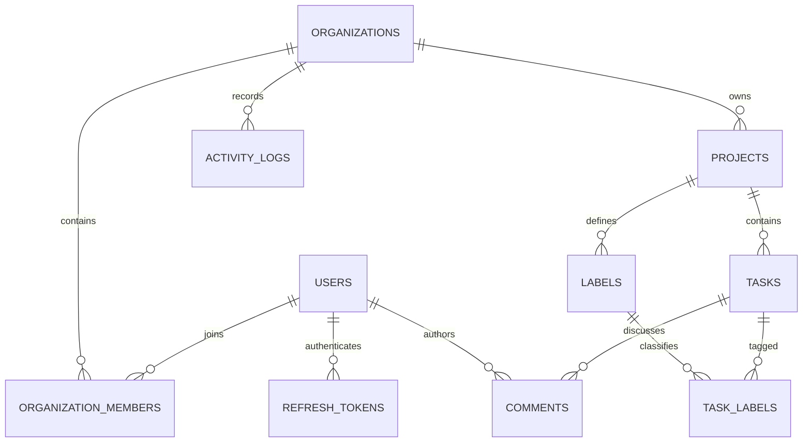
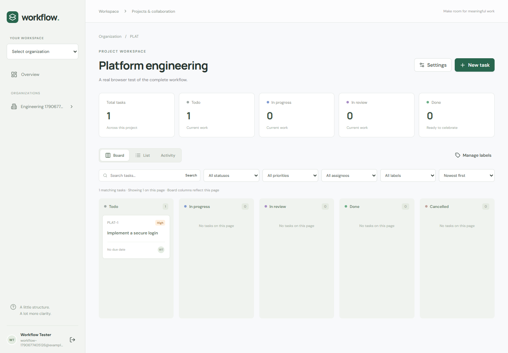
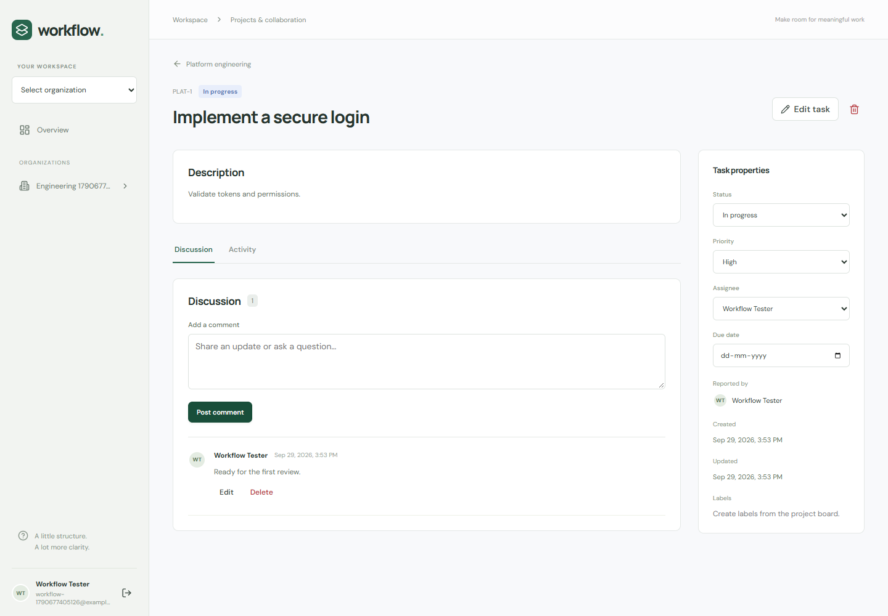

# Enterprise Workflow Management Platform

A full-stack project workspace built with Java 21, Spring Boot, React, and PostgreSQL. Users organize teams, manage projects, and move tasks through a validated workflow. All organization permissions are enforced by the backend.

This repository is an educational, interview-oriented application. It has not been deployed to production. Screenshots contain data created by the browser test, not real customer usage. See [verification](docs/verification.md) for executed checks and remaining limitations.

## 1. Overview

The application is a modular monolith: one Spring Boot API, one React application, and one PostgreSQL database. An organization is the tenant boundary. Users may have different roles in different organizations. All active members can see every project in their organization.

## 2. Features

- Registration, login, short-lived JWT access tokens, rotating refresh cookies, and logout.
- Organizations with OWNER, ADMIN, MANAGER, and MEMBER permissions.
- Adding existing registered users, changing allowed roles, and removing members.
- Projects with immutable keys, editable descriptions, and archive/restore.
- Tasks with project-scoped numbers, assignment, priorities, due dates, comments, and labels.
- Validated status transitions, optimistic edit versions, and transactional activity history.
- Search, status/priority/assignee/label filters, business-priority sorting, and database pagination.
- Board and table views, task details, member management, and project status counts.
- Flyway migrations, unit/API/browser tests, OpenAPI, Docker definitions, and GitHub Actions configuration.

## 3. Architecture

```text
React Router + AuthContext + centralized fetch client
                         |
                         v
Spring Security -> Controllers + validated request DTOs
                         |
              Services + authorization policies
                         |
              Spring Data JPA / Hibernate
                         |
               PostgreSQL + Flyway
```

Services define transactions and map entities into response DTOs. Controllers do not return entities. [Design decisions and review](docs/engineering.md) explain trade-offs and concurrency behavior.

## 4. Technology stack

Java 21, Spring Boot 3.5.16, Spring MVC, Spring Security, OAuth2 resource-server JWT support, Spring Data JPA, Hibernate, Bean Validation, Flyway, PostgreSQL, Maven Wrapper, and Springdoc. The client uses React 19, Vite 7, React Router 7, Fetch, and Lucide icons. Tests use JUnit 5, Mockito, Spring Boot Test, PostgreSQL/Testcontainers, Vitest, React Testing Library, and Playwright. Exact JavaScript dependencies are recorded in `frontend/package-lock.json`.

## 5. Database schema

The authoritative schema is [V1__initial_schema.sql](backend/src/main/resources/db/migration/V1__initial_schema.sql).



Foreign keys also connect reporters, assignees, creators, and activity actors to users. Composite foreign keys in `task_labels` enforce that each task and label belong to the same project. Membership has a surrogate UUID primary key and a unique `(organization_id, user_id)` constraint. There is at most one active owner; service rules create and preserve that owner.

## 6. Authentication

Access JWTs expire after 15 minutes and stay in browser memory. Refresh tokens use 32 random bytes, are stored only as SHA-256 hashes in the database, and are delivered through an HttpOnly cookie. Every refresh rotates the token. Reuse revokes its entire family. The family expires seven days after login; rotation does not extend that deadline.

Cookies use SameSite=Strict, and `COOKIE_SECURE=true` is required behind HTTPS. CSRF protection applies to authentication POST requests; the client obtains a token from `/api/auth/csrf`. Logout revokes the current refresh family. A previously issued access token can remain valid until expiration. See [API examples](docs/api.md).

## 7. RBAC

| Permission | OWNER | ADMIN | MANAGER | MEMBER |
|---|---|---|---|---|
| Read organization projects and tasks | Yes | Yes | Yes | Yes |
| Rename/delete organization | Yes | No | No | No |
| Manage admins | Yes | No | No | No |
| Manage managers/members | Yes | Yes | No | No |
| Create/edit/archive/delete projects | Yes | Yes | No | No |
| Create/delete/assign/prioritize tasks | Yes | Yes | Yes | No |
| Edit title/description/status | All tasks | All tasks | All tasks | Assigned tasks |
| Manage labels | Yes | Yes | Yes | No |
| Comment and edit own comments | Yes | Yes | Yes | Yes |
| Delete another user's comment | Yes | Yes | No | No |

Nobody can rewrite someone else's comment. Nobody can remove or demote the owner. Admins cannot manage other admins or promote themselves. Removed memberships grant no access. Archived projects permit reads and project restoration; task/comment/label mutations are rejected.

## 8. Task workflow

```text
TODO -> IN_PROGRESS -> IN_REVIEW -> DONE
         |                |
         +-> TODO         +-> IN_PROGRESS

TODO, IN_PROGRESS, IN_REVIEW -> CANCELLED
```

DONE and CANCELLED are terminal in this version. Repeating the existing status is a no-op. The backend checks every transition.

## 9. API architecture

Controllers validate request structure; services enforce business rules and authorization. DTO records define API contracts. Updates use presence-aware PATCH: omitted fields stay unchanged, explicit null clears permitted nullable fields, and unknown fields are rejected. Tasks, comments, organizations, and projects require a `version` for edits; stale changes receive 409.

## 10. Project structure

```text
backend/                  Maven application and Java tests
  src/main/java/com/example/workflow/
    auth/ user/ organization/ project/ task/
    comment/ label/ activity/ common/
  src/main/resources/db/migration/
frontend/                 React application and frontend tests
  src/api/ components/ context/ features/ hooks/ pages/ utils/
  e2e/                    Browser workflow test
scripts/                  Environment setup and loading
docs/                     API, learning guide, review, verification
.github/workflows/ci.yml   CI configuration
docker-compose.yml        Frontend + backend + PostgreSQL
```

`.tools/` contains ignored machine-local build tools and test resources used during development. It is not application source and is not required for Docker.

## 11. Installation

For the simplest setup, install Docker Engine/Desktop with Compose. For native development, install Java 21, Node.js 22.12 or newer in the 22.x line, and PostgreSQL 18. Maven is downloaded by the wrapper. Python is optional; PowerShell can generate secrets without Python.

From the repository root:

```powershell
powershell -ExecutionPolicy Bypass -File .\scripts\setup-env.ps1
```

Or, on any platform with Python:

```sh
python scripts/setup-env.py
```

These commands create `.env` with random secrets and never overwrite an existing file. Do not commit `.env`.

## 12. Environment variables

| Variable | Meaning |
|---|---|
| `DB_URL` | JDBC URL for a native backend; Compose supplies its internal database address |
| `DB_USERNAME` | PostgreSQL application role |
| `DB_PASSWORD` | Database password; generated locally |
| `JWT_SECRET` | HMAC signing secret; minimum 32 bytes; generated locally |
| `FRONTEND_ORIGIN` | Exact browser origin allowed by CORS |
| `COOKIE_SECURE` | `false` for local HTTP; `true` for HTTPS |
| `VITE_API_URL` | API base path; defaults to `/api`; Docker frontend build argument |
| `PORT` | Backend port, default 8080 |

Only the API base URL belongs in frontend configuration. Never put database credentials or JWT secrets in a `VITE_` variable.

## 13. Running locally

Create a PostgreSQL database named `workflow`, owned by an application role matching `.env`. Use an administrative PostgreSQL session to create the role/database and `\password workflow` to set its password without embedding it in command history. Match the password in `.env`.

In PowerShell, terminal 1:

```powershell
. .\scripts\load-env.ps1
$env:FRONTEND_ORIGIN = 'http://localhost:5173'
cd backend
.\mvnw.cmd spring-boot:run
```

Terminal 2:

```powershell
cd frontend
npm ci
npm run dev
```

Open **http://localhost:5173**. Use `localhost` consistently instead of mixing it with `127.0.0.1`, because browser origins and cookie hosts matter. Vite proxies `/api` to port 8080. Register a user, create an organization, and create your first project. There are no preconfigured production accounts.

Expected startup: Flyway applies the initial migration, Hibernate validates the schema, and `/actuator/health` returns `{"status":"UP"}`. On Linux/macOS, export the same environment variables and use `bash mvnw spring-boot:run`.

## 14. Docker

```sh
docker compose up --build -d --wait
```

Open **http://localhost:8081**. The backend is available on localhost:8080, and PostgreSQL is private to the Compose network. Services have readiness checks and PostgreSQL data uses a named volume. Application containers run without root privileges.

```sh
docker compose logs -f backend
docker compose down
```

`down` preserves database storage. Adding `-v` permanently removes the volume and its data. These container definitions have not been executed in the development environment because Docker was unavailable; CI includes a Compose build and browser job.

## 15. API endpoints

Core prefixes: `/api/auth`, `/api/organizations`, `/api/projects`, `/api/tasks`, `/api/comments`, and `/api/labels`. [API documentation](docs/api.md) lists operations, request fields, errors, and working PowerShell examples.

## 16. Swagger

Open **http://localhost:8080/swagger-ui**. The schema is at `/v3/api-docs`. Use the bearer authorization control for protected resource operations. Authentication POST endpoints also require the CSRF cookie/header pair; the application UI or API examples demonstrate that flow. Documentation is exposed locally; restrict it as appropriate before a public deployment.

## 17. Testing

Backend unit tests:

```powershell
cd backend
.\mvnw.cmd test
```

Full backend suite with Docker available (Testcontainers starts PostgreSQL):

```powershell
.\mvnw.cmd verify
```

Without Docker, create a **dedicated disposable** database ending in `_test` and run:

```powershell
$env:TEST_DB_URL = 'jdbc:postgresql://localhost:5432/workflow_test'
$env:TEST_DB_USERNAME = 'workflow'
$env:TEST_DB_PASSWORD = $env:DB_PASSWORD
.\mvnw.cmd verify
```

Integration tests truncate application tables in that test database. Never point these variables at valuable data. No H2 substitute is used. Reports are under `backend/target/surefire-reports` and `failsafe-reports`.

Frontend:

```powershell
cd frontend
npm ci
npm test
npm run build
```

With the application running, browser tests:

```powershell
npx playwright install chromium
npm run test:e2e
```

For Compose, set `$env:E2E_BASE_URL='http://localhost:8081'`. To use an existing Chrome installation, set `E2E_CHROME_PATH` to its executable. Browser tests create isolated example accounts and workspaces; they do not clear existing application data.

## 18. CI

GitHub Actions defines backend verification with Testcontainers, frontend tests/build/audit, and a Compose-backed browser test. The workflow has read-only repository permissions, uploads test artifacts, and does not deploy. It has not been run on GitHub from this workspace; defining CI is not evidence of a successful hosted run.

## 19. Security considerations

Authorization is checked from stored resource ownership, never a caller-supplied organization claim. Active memberships are read on protected operations, so removal blocks new resource access even while an access JWT remains valid. Validation rejects unknown fields, sort fields are allowlisted, and repository predicates bind parameters. CSRF protects cookie authentication, and React renders comments as text.

See [engineering review](docs/engineering.md) for threat boundaries and outstanding deployment hardening. This project does not claim a penetration test or production readiness certification.

## 20. Design decisions

Use a relational database for membership, assignment, and label consistency; use a monolith for local transactions; keep JWT verification in Spring Security; keep business authorization in service policies. Aggregate references use UUID fields and explicit batched reads rather than exposing navigable entity graphs. Organization write locks serialize membership changes and resource mutations; this favors simple correctness over maximum write concurrency.

## 21. Known limitations

- No email verification, password reset, MFA, invitations by email, or ownership transfer.
- Projects inherit organization access; there are no private subprojects.
- No immediate access-token revocation on logout, distributed login throttling, or automated expired-token cleanup.
- Organization/project/member/label lists are not paginated; task, comment, and activity lists are.
- Board columns show the current result page, clearly labeled in the UI.
- Search uses case-insensitive substring matching; large datasets may need trigram/full-text indexes.
- Organization-wide write locking can limit concurrency for large, busy organizations.
- No offline support, notifications, attachments, drag-and-drop, cloud deployment, or measured scalability guarantees.
- Docker/hosted CI need verification in a Docker-capable environment.

## 22. Future improvements

Evaluate email invitations and password recovery first, then finer-grained locking with concurrency tests, query-plan-driven search indexes, authentication abuse protection, token cleanup, and pagination for administrative lists. Add caching or real-time notifications only with a demonstrated need.

## 23. Screenshots

Screenshots are captured from the actual application by the browser test with `CAPTURE_SCREENSHOTS=1`. They show explicitly created test data.




## 24. Interview discussion topics

Read [the learning guide](docs/learning-guide.md), trace a task update through the source, then use [the interview prompts](docs/interview.md). The prompts intentionally do not provide memorized answers. [Phase ledger](docs/phases.md) maps the requested development phases to files and checks.

Resume claims must be limited to implemented, tested behavior. Do not claim deployment, user counts, latency, or scalability without evidence.
